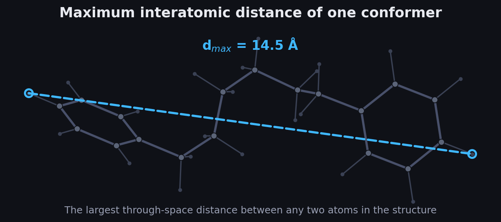
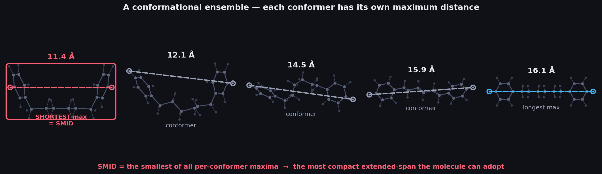
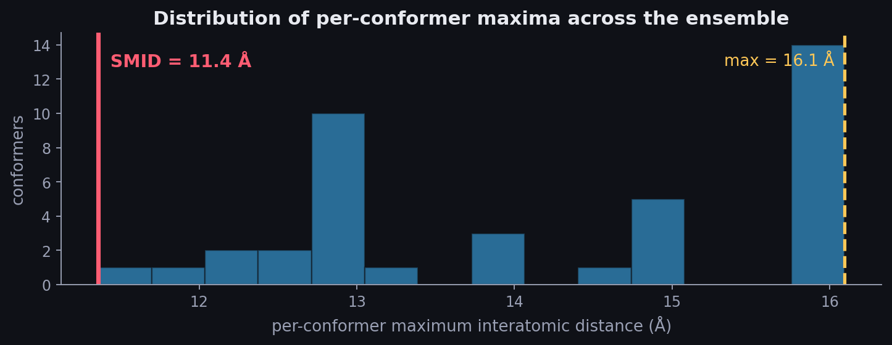

# SMID — Smallest Maximum Intramolecular Distance

[](https://www.python.org/)
[](https://www.rdkit.org/)
[](LICENSE)
[](https://doi.org/10.1021/acs.jcim.9b00692)

An [RDKit](https://www.rdkit.org/)-based script that takes a conformational ensemble (a multi-structure `.sdf` file), measures the **maximum intramolecular distance** of every conformer, and writes those values back out so you can extract the **smallest** one — the **Smallest Maximum Intramolecular Distance (SMID)**, a molecular descriptor introduced by Bower et al. (*J. Chem. Inf. Model.* **2020**).[¹](#reference)

---

## What is the Smallest Maximum Intramolecular Distance?

A flexible molecule does not have a single shape. In solution it samples many **conformers**, and each one occupies space differently — some stretched out, some folded up. SMID condenses that whole ensemble into a single, geometry-based number through a two-step "max-then-min" reduction.[¹](#reference)

**Step 1 — the maximum distance of one conformer.** For a given 3D structure, build the full pairwise distance matrix between all atoms and take its largest entry. This is the longest straight-line, through-space distance between any two atoms in the molecule — effectively its longest dimension, or "span," in that pose.



**Step 2 — the smallest of those maxima across the ensemble.** Repeat Step 1 for every conformer. You now have one maximum-distance value per conformer. The **SMID is the smallest of all those per-conformer maxima.** In other words, it is the longest dimension of the *most compact* shape the molecule is able to fold into.



Intuitively, SMID answers: *"When this molecule folds up as compactly as it can, how long is it still, at minimum, along its longest axis?"*



### Why it matters

SMID was introduced as a descriptor that correlates with activation of the **pregnane X receptor (PXR)**. Activation of PXR induces cytochrome P450 3A4 (CYP3A4) and is a liability in drug discovery and development because it can drive drug–drug interactions. Bower et al. proposed SMID as a descriptor correlated with PXR activation, together with a strategy for using it to guide medicinal chemists in modifying lead compounds so as to reduce PXR activation. The underlying rationale is steric: the PXR ligand-binding pocket favors compact molecules, so a larger SMID (a molecule that cannot collapse below a certain length) tends to be associated with weaker activation. SMID is therefore most useful as a flexibility- and size-aware design parameter in medicinal chemistry, rather than a simple static-size metric.

---

## How the script works

`SMID.py` performs exactly the two steps above:

1. Reads the ensemble with `Chem.SDMolSupplier(filename, removeHs=False)` — hydrogens are **kept**, so they count toward the maximum distance.
2. For each conformer, computes `AllChem.Get3DDistanceMatrix(mol).max()` — the maximum intramolecular distance — and stores it.
3. Loads the same file into a pandas DataFrame, attaches the values as a new column named **`mxdi`**, and writes a new file `output_<filename>` containing every original structure plus its `mxdi` value.

The SMID for the ensemble is then simply the **minimum of the `mxdi` column**.

---

## Installation

The script needs Python 3 with RDKit and pandas:

```bash
# with conda (recommended for RDKit)
conda install -c conda-forge rdkit pandas

# or with pip
pip install rdkit pandas
```

Then grab the script:

```bash
git clone https://github.com/a-aghamohammadi/smid.git
cd smid
```

---

## Usage

Pass a multi-conformer `.sdf` file as the only argument:

```bash
python3 SMID.py my_ensemble.sdf
```

On success it prints `Operation Successful` and writes **`output_my_ensemble.sdf`** in the working directory. If no file is given it prints `Unsupported Arguments`.

### Getting the SMID value

The script annotates each conformer with its maximum distance; the SMID is the smallest of those. A couple of lines of RDKit/pandas pulls it out:

```python
from rdkit.Chem import PandasTools

df = PandasTools.LoadSDF("output_my_ensemble.sdf")
df["mxdi"] = df["mxdi"].astype(float)

print("per-conformer maxima:", df["mxdi"].tolist())
print("SMID (smallest maximum intramolecular distance):", df["mxdi"].min())
```

---

## Input and output

| | Description |
|---|---|
| **Input** | A single `.sdf` file holding a conformational ensemble — multiple 3D structures of the same molecule. Coordinates must be present, and hydrogens are recommended (they are read in and used). |
| **Output** | `output_<input>.sdf` — the same structures, each carrying an additional `mxdi` property (its maximum intramolecular distance in Å). |

---

## Notes and caveats

- Each record in the input `.sdf` is treated as one conformer; values are computed per record. Make sure every entry has 3D coordinates.
- Because hydrogens are retained, the extreme atoms defining the maximum distance are often terminal H atoms. Strip them upstream if you want a heavy-atom-only measure.
- `mxdi` reports the *per-conformer maximum*. The single SMID number for the ensemble is the **minimum** of that column (see the snippet above).
- Distances are in ångströms, inherited from the coordinates in the `.sdf` file.

---

## Reference

The SMID descriptor and the strategy for applying it to reduce PXR activation were introduced in:

> <a id="reference"></a>**[1]** Bower, M. J.; Aronov, A. M.; Cleveland, T.; Hariparsad, N.; McGaughey, G. B.; McMasters, D. R.; Zhang, X.; Goldman, B. "Smallest Maximum Intramolecular Distance: A Novel Method to Mitigate Pregnane Xenobiotic Receptor Activation." *Journal of Chemical Information and Modeling* **2020**, *60* (4), 2091–2099. DOI: [10.1021/acs.jcim.9b00692](https://doi.org/10.1021/acs.jcim.9b00692)

This script is an independent RDKit implementation of that descriptor; please cite the paper above if you use SMID values in your work.

### BibTeX

```bibtex
@article{Bower2020SMID,
  title   = {Smallest Maximum Intramolecular Distance: A Novel Method to
             Mitigate Pregnane Xenobiotic Receptor Activation},
  author  = {Bower, Michael J. and Aronov, Alex M. and Cleveland, Thomas and
             Hariparsad, Niresh and McGaughey, Georgia B. and
             McMasters, Daniel R. and Zhang, Xiaodan and Goldman, Brian},
  journal = {Journal of Chemical Information and Modeling},
  volume  = {60},
  number  = {4},
  pages   = {2091--2099},
  year    = {2020},
  doi     = {10.1021/acs.jcim.9b00692}
}
```

---

## License

Released under the [MIT License](LICENSE). © 2026 InSilicoDev
